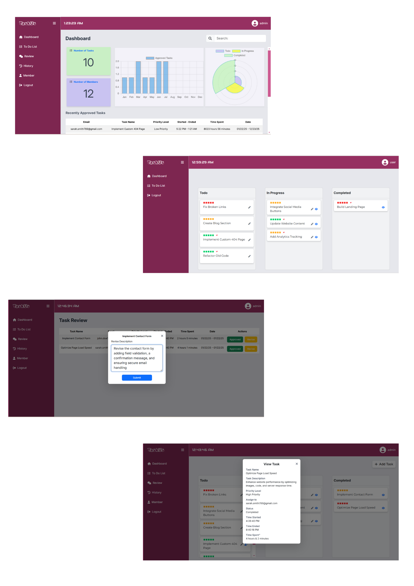

# Task Us - A Dynamic Task Management System
## Overview 📌
Task Us is an easy-to-use task management system that helps teams work together better and stay organized. It makes it simple to track tasks and see what needs to be done. The system helps both managers and team members keep everything on track and collaborate easily

## Features 📌
 - End User
    - Home: The main page with key information and navigation.
    - About: BestLink Mission/Vision.
    - Courses: Display available courses for enrollment.
    - Inquiry: Option for students to submit inquiries regarding admissions or courses.
    - Public Notice: A section for public announcements and important notices.
    - Admission: Online admission form submission.
 - Registra User
    - Dashboard: Overview of key statistics (total students, courses, admissions, inquiries, and recent students).
    - Admission List: Ability to view, read, and filter admission requests.
    - Enrollment List: View, update, and filter student enrollments
    - Student List: Create, read, update, and delete student records with search filters.
    - Requirement List: Manage admission requirements with CRUD functionality and filters.
    - Inquiry: View and filter student inquiries.
    - Public Notice: CRUD functionality for creating and managing public notices.
    - Reports: Generate and manage reports (including PDF generation) with search filters.
    - Settings: Allows the registrar to update their account password.
 - Head Admin
    - Dashboard: Overview of key statistics (students, courses, admissions, inquiries, schedule, subjects, sections, recent student, enrolled stundent).
    - Schedule: CRUD functionality for creating and managing academic schedules.
    - Section: Create, read, update, and delete course sections.
    - Course: CRUD functionality to manage available courses.
    - Subject: CRUD functionality to manage subjects offered within courses.
 - Login/Logout

## Tech Stack 📌
- **Frontend**: HTML (Blade templating), CSS, Bootstrap, JavaScript, Alpine.js
- **Backend**: PHP(LARAVEL)
- **Database**: MySQL
